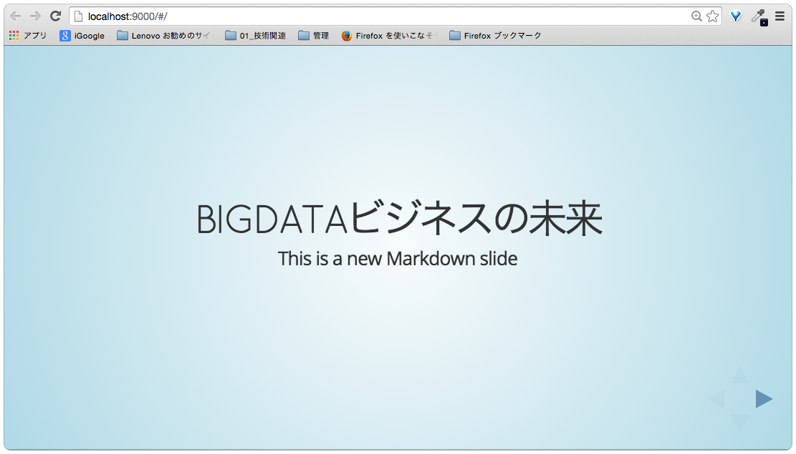

# Reveal.jsでプレゼン資料を作ってみよう


---

### はじめに

- Mac向けの資料ですがWindowsでも作成の流れは一緒ですので
- 詳しくはこちらの記事を参照ください。

http://qiita.com/fujii_kazunobu/items/08683419ea9c137c33c9

---

### Githubで資料作成用のレポジトリを作成する

(GitLabなどGithubクローンでも結構です)

例）


---

### 任意のディレクトリでGit Cloneします

例）

```
$ git clone https://github.com/hayao56/presentation0424.git
```

```
$ cd ./presentation0424
```

---

### Yeomanをインストールします

動作環境により再現できなくなることも想定されますので、インストール後に必ずバージョンを確認します。

例）
```
$ npm install -g bower grunt-cli yo
```

```
$ yo --version
1.4.6

$ grunt --version
grunt-cli v0.1.13

$ bower --version
1.4.1
```

---

### Reveal.jsのジェネレータをインストールします

```
$ npm install -g generator-reveal
```

```
generator-reveal@0.4.0 /usr/local/lib/node_modules/generator-reveal
├── semver@4.3.3
├── chalk@0.5.1 (ansi-styles@1.1.0, escape-string-regexp@1.0.3, supports-color@0.2.0, has-ansi@0.1.0, strip-ansi@0.3.0)
├── yosay@1.0.3 (string-length@1.0.0, ansi-styles@2.0.1, word-wrap@1.0.2, strip-ansi@2.0.1, ansi-regex@1.1.1, pad-component@0.0.1, minimist@1.1.1, taketalk@1.0.0, chalk@1.0.0)
└── yeoman-generator@0.18.10 (read-chunk@1.0.1, dargs@3.0.1, detect-conflict@1.0.0, yeoman-welcome@1.0.1, xdg-basedir@1.0.1, user-home@1.1.1, rimraf@2.3.2, class-extend@0.1.1, diff@1.3.2, text-table@0.2.0, mime@1.3.4, underscore.string@2.4.0, async@0.9.0, chalk@1.0.0, debug@2.1.3, istextorbinary@1.0.2, nopt@3.0.1, cross-spawn@0.2.8, yeoman-assert@1.0.0, run-async@0.1.0, mkdirp@0.5.0, shelljs@0.3.0, through2@0.6.3, dateformat@1.0.11, pretty-bytes@1.0.4, cli-table@0.3.1, glob@4.5.3, findup-sync@0.2.1, github-username@1.1.1, file-utils@0.2.2, lodash@2.4.1, sinon@1.14.1, download@3.3.0, gruntfile-editor@0.2.0, cheerio@0.18.0, mem-fs-editor@1.2.3, yeoman-environment@1.2.5, inquirer@0.8.2)
```

---

### Yeomanで Reveal.jsのプロジェクトを作成します

```
$ yo reveal
```
質問はすべてデフォルト設定、Enterで回答する


---

### 画像フォルダを作成

```
$ mkdir images
```

---

### スライドの追加

例）
```
$ yo reveal:slide "Bigdataビジネスの未来"
```

```
slides
├── bigdata.md    <--追加されました
├── index.md
└── list.json
```

ファイル名は適当につけられますが、list.jsonを編集して変更できます。
自動生成時に「日本語」は無視されるようです。

### スライドファイルを開いてみる

例）
templates/bigdata.md
```
##  Bigdataビジネスの未来

This is a new Markdown slide
```

---

### スライドの順番を変更

slides/list.json を編集します。

例）
```
[
    "bigdata.md",   <-- 並べた順に表示される
    "index.md"
]
```

### テーマを選ぶ

公式テーマは９種類あります
```
bower_components/reveal.js/css/theme/
├── README.md
├── beige.css
├── blood.css
├── default.css
├── moon.css
├── night.css
├── serif.css
├── simple.css
├── sky.css
├── solarized.css
├── source
└── template
```

### テーマを変更する

例）
templates/_index.html を編集

```
　<link rel="stylesheet" href="bower_components/reveal.js/css/theme/default.css" id="theme">
```
↓  default.css を sky.css に変更

```
　<link rel="stylesheet" href="bower_components/reveal.js/css/theme/sky.css" id="theme">
```


### スライドを起動する

```
$ grunt serve
```



### ページを追加

以下を2ページ目、３ページ目を追記してみましょう

例）
templates/bigdata.md
```
##  Bigdataビジネスの未来

This is a new Markdown slide

---

# page 2

---

# page 3
```


### スライドをPDFで出力

#### 1. Chromeをデフォルトブラウザ設定にする

PDFで出力するため

```
設定 --> 規定のブラウザに変更
```

#### 2. スライドをChromeで起動


```
$ grunt
```

#### 3. URLを変更する

```
http://localhost:9000/?#/
```
   ↓  print-pdf を追加
```
http://localhost:9000/?print-pdf#/
```

#### 4. PDF出力

ChromeのメニューからPDF保存

```
ファイル --> 印刷 --> 送信先を「PDFに保存」--> 保存
```


#### 5. 出力結果を確認

リンクが表示されていない等表示がおかしい場合は下記箇所を修正すると良い。

index.html 22行目あたり

参考サイト http://libitte.hatenablog.jp/entry/20141129/1417252936

```
<!-- If the query includes 'print-pdf', use the PDF print sheet -->
<script>
if( window.location.search.match( /print-pdf/gi ) ) {
    var link = document.createElement( 'link' );
    link.rel = 'stylesheet';
    link.type = 'text/css';
    link.href = 'bower_components/reveal.js/css/print/pdf.css';
    document.getElementsByTagName( 'head' )[0].appendChild( link );
}
</script>
```


<div class="slides">
  <section data-markdown data-separator="^\n---$" data-vertical="^\n>>>$">
    <script type="text/template">
      Page 1

      ---
      Page 2

      >>>
      Page 2.2

    </script>
  </section>
</div>
